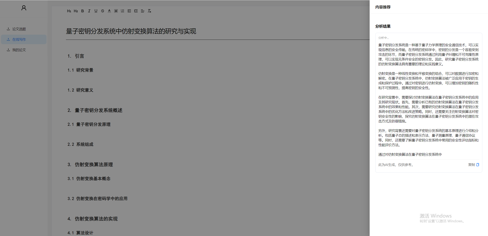

# AI写作系统

## 项目介绍

这是一个AI写作系统，旨在帮助用户自动生成文本内容。该系统具备多种功能，包括题目生成、大纲生成、续写和改错，适用于各类写作需求。

## 功能描述

- **题目生成**：根据用户输入的关键词生成合适的写作题目。
- **大纲生成**：自动生成文章的基本结构和框架。
- **续写**：在用户提供的文本基础上继续生成文章内容。
- **改错**：对提供的文本进行语法和拼写错误的检测与修正。

## 安装依赖

请确保已安装Python和pip。运行以下命令安装所需的依赖：

```bash
pip install -r requirements.txt
```

## 使用Docker部署MongoDB

首先，确保已安装Docker。使用以下命令来部署MongoDB：

```bash
docker pull mongo
docker run -d -p 27017:27017 --name mongodb mongo
```

## 运行项目

运行以下命令来启动项目：

```bash
python main.py
```

## 项目截图

1. **首页界面**：
   

2. **功能选择界面**：
   

3. **结果展示界面**：
   


